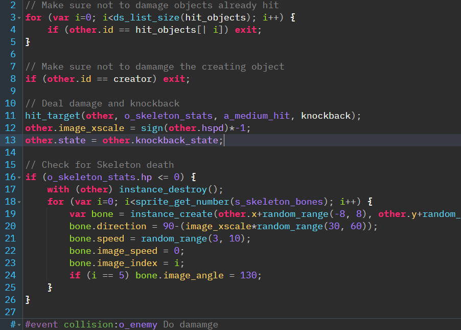

# Monokai for GMEdit
This repository contains a Monokai-like theme for [GMEdit](https://github.com/GameMakerDiscord/GMEdit). It's based on the official Monokai color scheme and the Dark theme that comes with GMEdit.

# Screenshot

# Install
Just drop the `Monokai` folder into `resources/app/themes`.